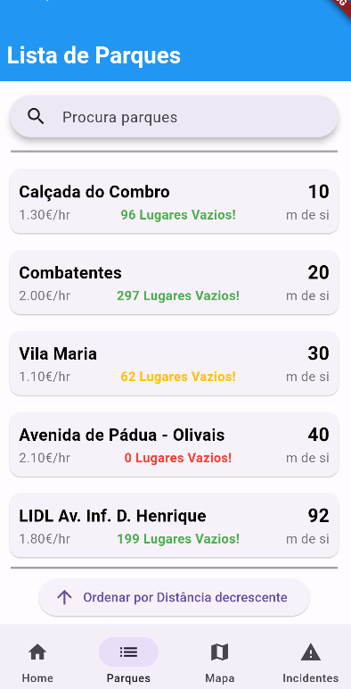
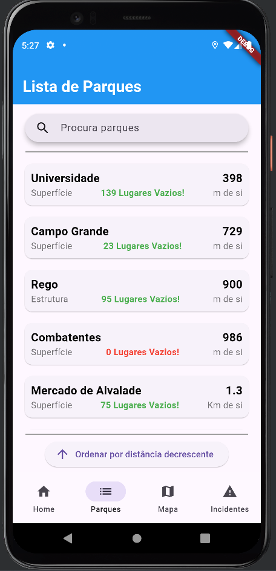
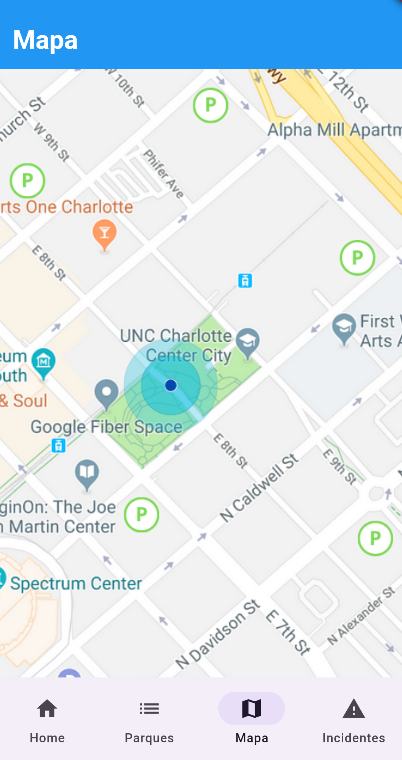
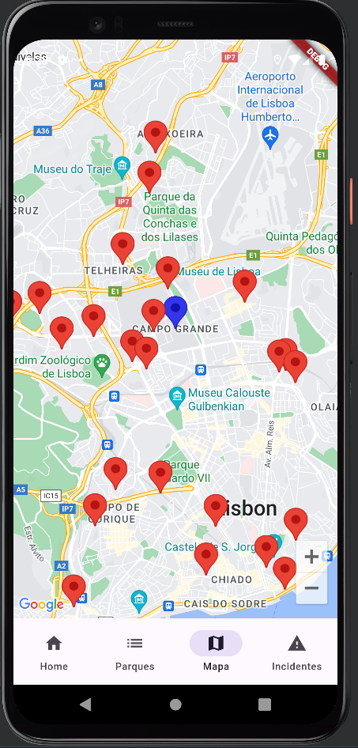
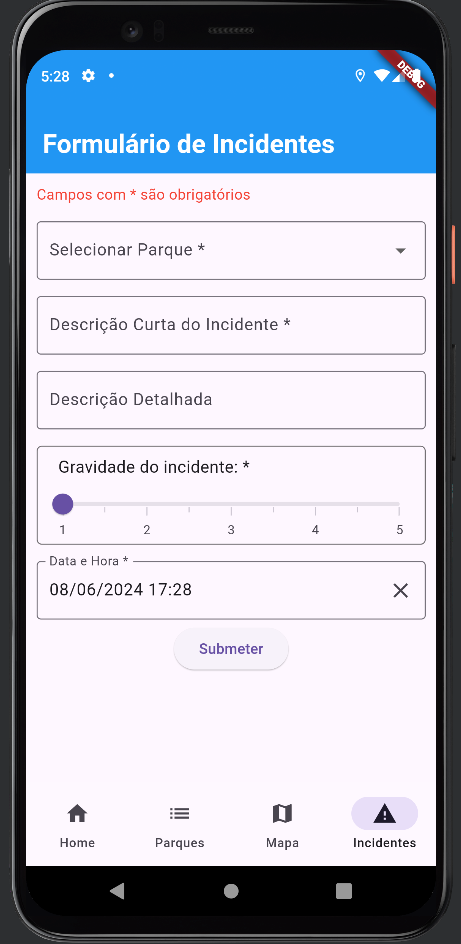
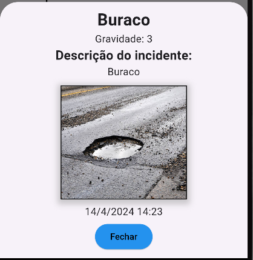
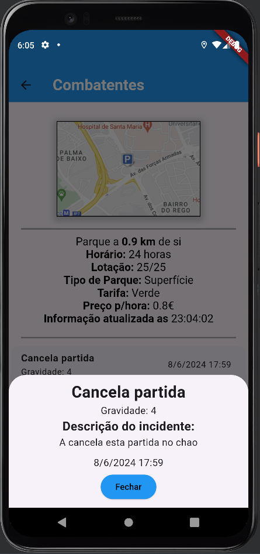

# Projeto de Computação móvel

Este projeto foi realizado por:
-Filipe Oliveira (a22109080)
-Rodrigo Taciano (a22204447)

Neste trabalho, vão existir vários ecrãs, entre eles:

-**Dashboard**:
    

No Dashboard, podemos encontrar 3 funcionalidades:
    - No topo, aparecem os 3 incidentes mais recentes reportados no prório dia. Por exemplo, no dia 08/06/2024 foram reportados 10 incidentes, então irá ser mostrado os 3 mais recentes
    - Mais a meio, irá aparecer um mapa com a localização atual do utilizador e os parques ao seu redor, mas este mapa está mais amplidado. Sempre que o utilizador clica num dos pins a vermelho ele irá ser redirecionado para o parque correspondente
    - No fim, irão aparecer os 3 parques mais próximos da localização atual do utilizador, com alguma informação básica sobre o parque. 

-**Lista de Parques**:

Na lista de parques, podemos encontrar 3 funcionalidades:
    - Uma barra de pesquisa, que permite procurar por qualquer parque que esteja na aplicação;
    - Uma lista com todos os parques, em que terá informação básica sobre o parque, como nome, distancia ao utilizador, tipo de parque e número de lugares vazios;
    - Um butão que permite ordenar a lista de parques por ordem crescente e decrescente.    

Relativamente aos parques com lotação negativa, consideramos que esses parques teriam a mesma lotação da lotação máxima, ou seja, totada.

-**Detalhes de um parque**:

No detalhe do parque podemos encontrar:
    - Uma imagem que mostra a localização do parque num pequeno mapa
    - Informações do parque, como distancia do utilizador, horario, lotação, tipo de parque, tarifa, preço e a hora em que a informação foi atualizada;
    - Um espaço em que é possivel visualizar os incidentes que foram reportados no parque.
    - Butões de acesso rápido ao mapa e ao report de incidentes.

-**Mapa**:

O Mapa permite:
    - Visualizar a localização atual do utilizador (pin azul)
    - Visualizar a localização dos parques (pins a vermelho)
    - Ampliar/reduzir o mapa

-**Registo de incidentes**:

    
Para o utilizador registar um  incidente, têm que preencher obrigatoriamente:
    - Parque
    - Descrição curta do incidente
    - Gravidade
    - Data e hora

Opcionalmente, o utilizador pode adicinar uma descrição detalhada

Após registar um incidente, o utilizador pode visualizar o incidente no detalhe do parque que selecionou, como mostra nas imagens abaixo:

Ao clicar no incidente depara-se com o detalhe do incidente:

**Offline**:

Esta aplicação têm várias funcionalidades que funcionam sem internet(no entanto, precisam de conexão anterior para funcionar). Entre elas:
    - No dashboard aparece com toda a informação funcional, a indicação dos incidentes, mapa e 3 parques próximos.
    - Na lista de paques aparece todos os parques com as informações iguais de quando esteve online pela ultima vez. 
    - No detalhe do parque, apenas funciona com informação que já foi obtida na api, ou seja, é necessário clicar no detalhe quando esta teve online, para aparecer o mesmo detalhe em modo offline. Detalhes de parques não clicados não funciona.
    - No mapa, toda a informação funciona.
    - Nos incidentes, toda a informação funciona.

**Localização**

Sempre que se inicia a aplicação pela primeira vez, é necessário pedir ao utilizador a sua localização atual. Assim, podemos saber a que distancia está o utilizador dos parques e a localização atual do utilizador.
No entanto, o utilizador pode recusar essa permissão. Ao recusar, o utilizador pode aceder á aplicação normalmente, apenas fiquem sem as possibilidades de saber a distancia a cada parque e de saber a localização atual do utilizador.

**Incidentes**

O registo de incidentes é guardado de forma pressistente na aplicação. O utilizador ao "matar" a aplicação continua a saber qual os incidentes que foram reportados nos parques.

*Toda esta informação descrita acima encontra-se mais detalhada no seguinte vídeo:*https://youtu.be/mnyqrCAiax8

**Arquitetura da aplicação:**

Para esta aplicação, foi utilizada uma bottombar para uma navegação mais fácil entre as páginas da aplicação. 

UI (User Interface) - Responsável pelas telas, páginas e widgets da aplicação com que o utilizador interage.

Lógica de negócio - Responsável pelo processamento de dados, comunicação com a API da EMEL e com a base de dados dos incidentes e parques.

A utilização de dependecias (provider) também foi usada neste projeto, assim são fornecidas as dependencias de uma classe em vez de ser a própria classe instanciar suas dependências, de modo a conseguir reaproveitar mais o código. 

Esta aplicação foi implementada com o padrão Model-View-ViewModel, em que:
    - Model: Representa a estrutura dos dados, podendo incluir definição de classes para os dados;
    - View: Representa a interface do utilizador, construida com widgets do Flutter, e vai ser responsavel pela renderização dos dados fornecidos pelo ViewModel.
    - ViewModel: Atua como um intermediário entre a View e o Model e é responsavel por notificar a view sobre mudanças nos dados.

**Classes**

1. Classe Lote:

    -Atributos:
        * id - String;
        * nome - String;
        * nome - String;
        * lotAtual - int;
        * lotMaxima - int;
        * dataAtualizacao - String;
        * latitude - String;
        * longitude - String;
        * tipoParque - String;
        * distancia - double?;
        * assertImagem - String?;

    -Métodos:
        * toDb();
        * fromJSON(Map<String, dynamic> map);
        * fromDB(Map<String, dynamic> map);

Esta classe ficou com o nome de Lote, devido ao nome que a propria api da EMEL têm, assim fica mais fácil de perceber.

Todos estes atributos são valores que são sempre garantidos quando se obtem os dados a partir da api da EMEL, com excepção dos atributos *distancia* e *assertImagem*:
    - Na distancia, o utilizador pode decidir não dar permissão ao utilizador, pelo que o valor pode ser null;
    - Na assertImagem, poderá não existir uma imagem correspondente ao parque.

Os métodos usados foram:
    -toDB(): Não recebe nenhum parametro, e é responsavel em transferir os dados de cada objeto para a base de dados local;
    -fromJSON(Map<String, dynamic> map): recebe um map JSON em que irá converte-lo em um objeto desta classe;
    -fromDB(Map<String, dynamic> map): recebe um map da base de dados que irá converte-lo num objeto desta classe;

2. Classe Zone:

   -Atributos:
      * produto - String;
      * horarioespecifico - String;
      * tarifa - String;

   -Métodos:
      * toDb(String idParque);
      * fromDB(Map<String, dynamic> map);

Esta classe ficou com o nome de Zone, devido ao nome que a propria api da EMEL têm, assim fica mais fácil de perceber.

Todos estes atributos são valores que são sempre garantidos quando se obtem os dados a partir da api da EMEL.

Os métodos usados foram:
    -toDB(String idParque): Recebe um id do parque, e é responsavel em transferir os dados do parque obtido na api da EMEL com o atributo idParque para a base de dados local;
    -fromDB(Map<String, dynamic> map): recebe um map da base de dados que irá converte-lo num objeto desta classe;

3. Classe Incidente:

   -Atributos:
        * produto - String;
        * horarioespecifico - String;
        * tarifa - String;

   -Métodos:
        * toDb();
        * fromDB(Map<String, dynamic> map);

Os métodos usados foram:
    -toDB(String idParque): Não recebe nenhum parametro, e é responsavel em transferir os dados de cada objeto para a base de dados local;
    -fromDB(Map<String, dynamic> map): recebe um map da base de dados que irá converte-lo num objeto desta classe;

4. Classe Tarifa:

   -Atributos:
        * cor - String;
        * preco - double;
        * duracaoMax - int;

   -Métodos:
        * Sem nenhum método;

Esta classe serve para identificar as tarifas existentes nos parques da EMEL. Proveniente da API, cada parque têm como atributo um tarifa que pode ser de várias cores. Cada cor representa informações sobre o parque. Estas informações podem ser encontradas no website oficial da EMEL, a partir do link: https://www.emel.pt/pt/onde-estacionar/via-publica/tarifarios/ (acedido em junho de 2024)

5. Classe Tarifas:
    -Atributos:
        *List<Tarifa> tarifas;

   -Métodos:
        * Sem nenhum método;

Esta classe serve apenas para instanciar todas as tarifas existentes

**Fontes de informação**

As principais fontes de informação além dos videos do professor foram para o mapa, a partir dos links:
    -https://stackoverflow.com/questions/69700936/flutter-application-wont-run-without-google-play-service
    -https://www.youtube.com/watch?v=M7cOmiSly3Q&t=677s
    -https://pub.dev/packages/google_maps_flutter
    -https://pub.dev/packages/geolocator

Para este trabalho, prevemos obter uma nota de 15 valores.

