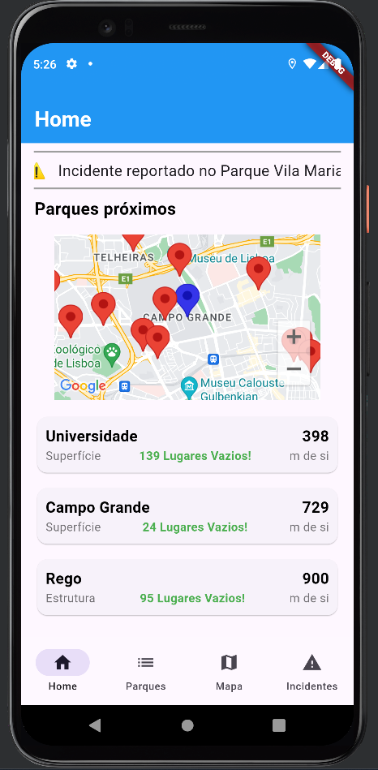
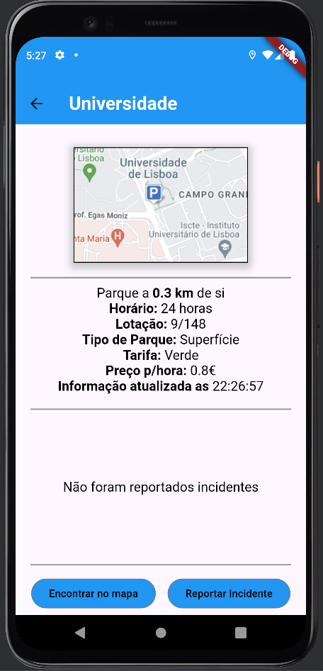
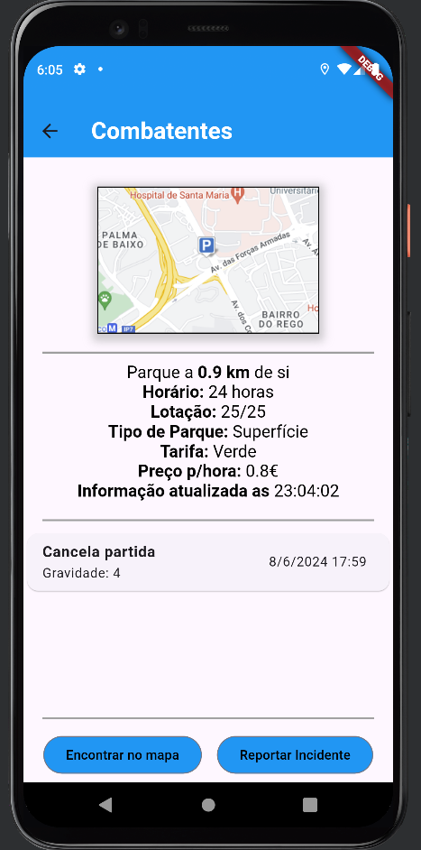

# Projeto de Computação móvel

Este projeto foi realizado por:
-Filipe Oliveira (a22109080)
-Rodrigo Taciano (a22204447)

Neste trabalho, vão existir vários ecrãs, entre eles:

-Dashboard:

    -Funcionalidades do Dashboard:
        1. No top, sempre que um user reporta um incidente, ele aparece que que foi reportado no parque "x",
        a uma certa hora. Neste espaço aparece a informação dos 3 ultimos reports feitos recentemente.
        2. Mapa com a localização atual e os parques mais proximos
        3. 3 parques mais proximos da sua localização atual, que ao clicando neles vai para a página de detalhe do mesmo

-Lista de Parques:

    -Funcionalidades da lista de parques:
        1. Barra de pesquisa, em que o user pode pesquisar o parque pelo nome do mesmo, acedendo á página de 
        detalhe sempre que encontra o que procura.
        2. Lista com todos os parque, ordenados, por default, por menor distancia de si.
        3. Ordenação dos parques por distancia atual

-Mapa:

-Registo de incidentes:

    -Funcionalidades do Registo de incidentes:
        1. Submissão de dados obrigatórios, como o parque, uma descrição curta, gravidade do incidente, data e hora
        2. Submissão adicional de dados facultativos, como uma descrição detalhada do acontecimento e uma imagem

-Detalhes de um parque:

    -Funcionalidades do Detalhe de um parque:
        1. Visualização detalhada das informações do parque
        2. Sempre que algum user reporta um incidente num parque, aparece nesse parque que foi 
        repotado um incidente e, sempre que o user clica, aparece uma pequena janela com mais informações 
        desse incidente, podendo conter, ou não, uma descriçaõ detalhada do incidnete e imagem. 
        Pode-se ver um exemplo abaixo:
        
        3. A partir do ecrã de detalhe, o user pode reportar um incidente ou encontrar o parque no mapa

Para este trabalho, previmos que iremos obter uma nota de 15 valores.

